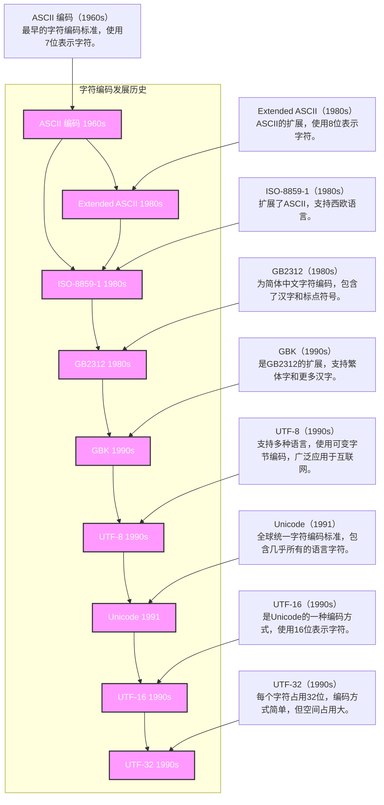

### 二进制

**二进制简介**

二进制是一种数字表示法，它使用两个不同的数字符号，0 和 1，来表示数值。

**1**）位（**bit**）

不同于十进制中，每个位可以用 0-9 表示，二进制中每位都是 0 或 1，每个二进制位我们称之为一个 bit，可以表示两种状态。位一般用 b 代替，例如 8b 代表 8 个 bit。

**2**）字节（*byte*）

8bit组成一个字节，总共可以表示 256种状态。字节一般用 B代替，例如 8B一般表示 8个字节。

**3**）其他计量单位（**K*，***M，）

K：表示 2 的十次方，例如，1KB 就是 1024B

M：表示 2 的 20 次方。例如：1MB 就是 1048576B

G：表示 2 的 30 次方。

T：表示 2 的 40 次方。

二进制是计算机科学的基础，现实中的绝大部分信息都可以完全数字化，并进一步用二进制来表示和存储。

#### 二进制表示数据

由二进制表示数据，引出了编码与解码的问题

#### 二进制表示颜色

图片数字化的过程，分为几步：

**1**）图片像素化

现实中的图片是连续的，但如果想用数字表示图像，就需要将一张完整的图像，横纵向分别切成很多份，从而拆成一个一个像素点，每个像素点是一个色块，而横纵切分的份数，我们称之为分辨率。例如，我们将一张 4比 3比例的图像，横向拆成 800份，纵向拆成600份，那么我们就将一个图像拆成了480000个像素，而这张图像的分辨率为800x600。由此可见，图像的分辨率越高，图像就越清晰。

**2**）像素数字化

每个像素就是一个颜色块。具体的颜色，可以用红绿蓝三原色调配成。而每种原色，就可以用一个数字表示其深浅。例如，我们用一个字节（0-255）表示一种颜色的深浅，那么一个像素点就可以用三个字节表示。颜色的深浅是连续的，用0-255这种级别如果不够精确，我们可以选择用两个字节表示一个颜色（0-65535）。像素的深浅级别我们称为“位深”，例如0-255为8位深，0-65535是16位深。位深越大，颜色切分越连续，越不容易出现色阶。现今网络上的图像一般都是 32 位深。

#### 二进制表示声音

声音的数字化和图像的过程非常类似：

**1**）采样

声音来自于物体的振动，是一种连续的波形。我们如果想用数字表达声音，还是要将其离散化。首先我们将一段时间（例如 1 秒钟）的连续声波分成很多份，并将每一份记录一个平均振幅。拆分的份数，我们称之为采样率。拆分过程中必然会产生信息丢失，而采样率越大，信息丢失越少。目前比较常用的采样率是 44100HZ 或者 48000HZ。

**2**）量化

每个采样我们还要用一个数字表示它的高度（振幅），这又是一个连续量离散化的过程，跟图像的颜色深浅类似，我们也可以用 0-255 或者 0-65535 表示振幅的高度。这个数字的取值范围叫做声音的位深。目前通用的位深一般是 16bit 或者 24bit。

**声音 + 图片 = 视频**

### 数字电路

#### 非门

反转，即如果输入是高电平（通常表示为逻辑1），那么输出将是低电平（通常表示为逻辑0）；反之，如果输入是低电平（逻辑0），则输出将变为高电平（逻辑1）。非门有时也被称作反相器（Inverter）。

非门的逻辑符号是一个三角形，后面跟着一个小圆圈。这个小圆圈代表了“否定”或“反转”的操作。在电路图中，这样的符号可以很容易地被识别出来。

非门的真值表如下：

| 输入 (A) | 输出 (¬A) |
| -------- | --------- |
| 0        | 1         |
| 1        | 0         |

#### 与门

与门（AND gate）是数字逻辑电路中的基本逻辑门之一，用于执行逻辑乘法（即逻辑“与”操作）。与门有两个或更多的输入和一个输出。它的功能是只有当所有输入均为高电平（逻辑1）时，输出才会为高电平；只要有一个或多个输入为低电平（逻辑0），输出就为低电平。

与门的逻辑符号通常是一个D形状的图形，带有标记“AND”或者直接用符号表示，具体取决于使用的标准。在布尔代数中，与操作通常用点（.）来表示，有时也省略不写，例如 A.B 或者 AB 表示A与B的逻辑“与”。

与门的真值表如下所示：

| 输入 A | 输入 B | 输出 (A · B) |
| ------ | ------ | ------------ |
| 0      | 0      | 0            |
| 0      | 1      | 0            |
| 1      | 0      | 0            |
| 1      | 1      | 1            |

#### 或门

或门（OR gate）是数字逻辑电路中的另一种基本逻辑门，用于执行逻辑加法（即逻辑“或”操作）。与门不同的是，或门只要有一个输入为高电平（逻辑1），输出就为高电平；只有当所有输入均为低电平（逻辑0）时，输出才为低电平。

或门的逻辑符号通常是一个D形状的图形，带有标记“OR”，或者直接使用特定的符号来表示。在布尔代数中，或操作通常用加号（+）来表示，例如 A + B 表示A或B的逻辑“或”。

或门的真值表如下所示：

| 输入 A | 输入 B | 输出 (A + B) |
| ------ | ------ | ------------ |
| 0      | 0      | 0            |
| 0      | 1      | 1            |
| 1      | 0      | 1            |
| 1      | 1      | 1            |

#### 逻辑门总结

### 实现一个简单的运算器

**1半加器**

假如有两个 1 位二进制数 A、B，它们的和为 1 位二进制数 S，那么存在如下枚举：

（1）如果 A=0，B=0，那么 S=0；

（2）如果 A=1，B=0，那么 S=1；

（3）如果 A=0，B=1，那么 S=1；

（4）如果 A=1，B=1，那么 S=0，而且产生一个进位 C=1。

也就是说，对于加法运算，应该两个输入 A 和 B，两个输出 S 和 C，S 表示和，C 表示是否产生进位，也就是说真值表如下图所示：

|   A   |   B   |   S   | C（进位） |
| :---: | :---: | :---: | :-------: |
|   0   |   0   |   0   |     0     |
|   0   |   1   |   1   |     0     |
|   1   |   0   |   1   |     0     |
|   1   |   1   |   0   |     1     |

其中 A、B 与 S 的关系为**异或**，与 C 的关系为**与**，得到如下电路图：

总结：异或运算 + 与运算

**2 加法器**

半加器实现一位全加器。半加器只能处理两个数的运算，但在实际计算中，如果我们做加法的两个位不是最低的位，那就要考虑低位可能产生的进位。也就是说，一个功能完整的 1 位加法器，应该考虑三个输入，除了 A、B 两个加数，还要考虑是否存在低位进位 Cin。

为了处理三个数相加，我们可以用两个半加器分别处理两个累加过程，同时两个累加器产生的进位 C1 和 C2，不可能同时为 1，（因为如果 C1 位 1，那么 S1=0，S1=0，C2 不可能为 1），且二者只要有一个为 1，则输出进位为 1，所以关系为或，最终呈现的电路如下：

#### 锁存器和触发器

当输入信号发生变化，输出信号会立刻变化，**无法对状态进行存储**。这在某些情况下会给我们的计算带来麻烦，

**SR** **锁存器**

**1SR 锁存器的电路结构：**

SR 锁存器（set-reset-Latch）是静态存储单元中最基本、也是电路结构中最简单的一种

电路。SR 锁存器可以有两种构成方式。

方式一，由两个或非门构成。

方式二，由两个与非门构成。

两种方式构成的 SR 锁存器功能相同。

D**触发器**

D 锁存器尽管可以起到保存数据的作用，但是当 en 信号为 1 时，D 输入和 Q 输出相当于是联通的，此时如果 D 信号有波动，Q 会跟随波动。我们希望能得到更稳定的输出 Q，不希望 en 高电平时 Q 随 D 波动，而是希望 Q 只在 en 信号由 0 变成 1 的一瞬间随 D 输入变化，其他时间都保持不变。看下面的电路图

边沿触发的D触发器

开启仿真后，经过实验得知，C 信号不论是高电平还是低电平，Q 都不会随 D 变化；只有当 C信号由 0变 1的一瞬间，D的值能够传递到 Q。这个电路我们称为上升沿触发。

**寄存器**

>  这时候引入了**时钟**的概念，时钟对开关的状态进行切换，用来进行数据的存储刷新

D 触发器可以在时钟上沿存储 1bit 数据，如果我们想存储多个 bit 的数据，就需要用多个 D 触发器并联实现，这种电路我们称之为寄存器。

